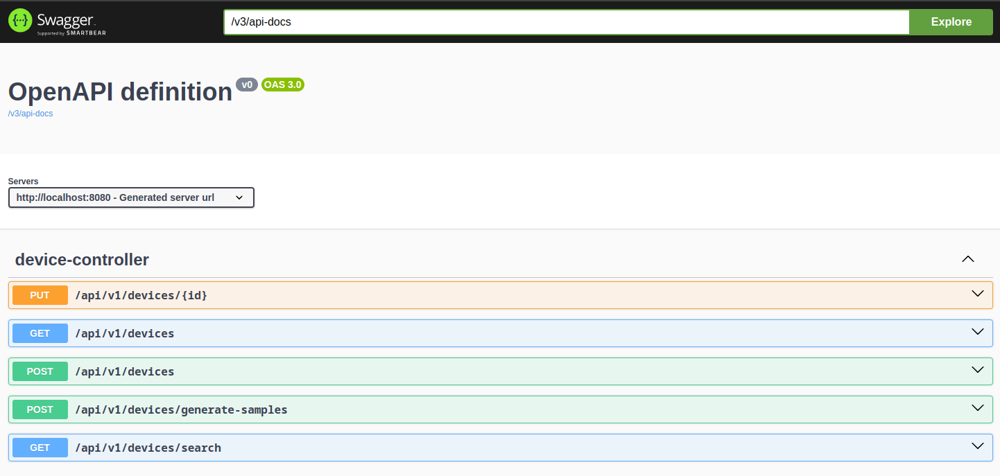

# سیستم مدیریت دستگاه‌های موبایل

این پروژه یک برنامه Spring Boot برای مدیریت موجودی دستگاه‌های موبایل است که قابلیت ثبت تغییرات (audit) را دارد. این برنامه APIهای REST برای مدیریت دستگاه‌ها با قابلیت ردیابی خودکار اطلاعات ایجاد و تغییر را فراهم می‌کند.

## ویژگی‌ها

- عملیات CRUD برای دستگاه‌های موبایل
- قابلیت جستجوی پیشرفته با معیارهای متعدد
- ثبت خودکار تغییرات برای تمام موجودیت‌ها
- تولید داده‌های نمونه
- پایگاه داده H2 درون‌حافظه‌ای
- مستندات Swagger/OpenAPI

## پشته فنی

- Java 17
- Spring Boot 3.2.0
- Spring Data JPA
- H2 Database
- Lombok
- SpringDoc OpenAPI (Swagger)

## شروع به کار

### پیش‌نیازها
- Java 17 یا بالاتر
- Maven

### اجرای برنامه
1. کلون کردن مخزن
2. اجرای برنامه:
```bash
mvn spring-boot:run
```
برنامه در آدرس `http://localhost:8081` اجرا خواهد شد.

## مستندات API

### رابط کاربری Swagger
می‌توانید به رابط کاربری Swagger در آدرس زیر دسترسی داشته باشید:
```
http://localhost:8081/swagger-ui.html
```



### نقاط پایانی موجود

1. **تولید داده‌های نمونه**
    - `POST /api/v1/devices/generate-samples`
    - پر کردن پایگاه داده با داده‌های نمونه دستگاه‌ها

2. **ایجاد دستگاه جدید**
    - `POST /api/v1/devices`
    - ایجاد یک دستگاه جدید با متادیتای audit خودکار

3. **به‌روزرسانی دستگاه**
    - `PUT /api/v1/devices/{id}`
    - به‌روزرسانی یک دستگاه موجود با حفظ تاریخچه تغییرات

4. **جستجوی دستگاه‌ها**
    - `GET /api/v1/devices/search`
    - پشتیبانی از معیارهای جستجوی متعدد:
        - سازنده (امکان انتخاب چند مقدار)
        - رنگ (امکان انتخاب چند مقدار)
        - حافظه (امکان انتخاب چند مقدار)
        - موجود در انبار (بولین)

5. **دریافت همه دستگاه‌ها**
    - `GET /api/v1/devices`
    - بازیابی تمام دستگاه‌ها همراه با اطلاعات audit

## سیستم Audit

این پروژه یک سیستم جامع audit پیاده‌سازی می‌کند که به طور خودکار موارد زیر را پیگیری می‌کند:

### متادیتای Audit
- **createdBy**: شناسه کاربر/سیستمی که رکورد را ایجاد کرده
- **createdAt**: زمان ایجاد رکورد
- **lastModifiedBy**: شناسه کاربر/سیستمی که آخرین بار رکورد را تغییر داده
- **lastModifiedAt**: زمان آخرین تغییر

### پیاده‌سازی Audit

1. **AuditMetadata (Embeddable)**
    - ذخیره فیلدهای audit
    - به طور خودکار در موجودیت‌های قابل audit جاسازی می‌شود

2. **رابط Auditable**
    - تعریف قرارداد برای موجودیت‌های قابل audit
    - ارائه getter/setter برای متادیتای audit

3. **AuditListener**
    - ثبت خودکار رویدادهای ایجاد/تغییر
    - استفاده از annotation‌های @PrePersist و @PreUpdate از JPA
    - دریافت اطلاعات درخواست فعلی برای ردیابی کاربر

4. **AuditLogger**
    - ارائه قابلیت‌های لاگ‌گیری برای رویدادهای audit
    - ثبت رویدادهای ایجاد و تغییر

### نمونه پاسخ JSON با Audit
```json
{
  "id": 1,
  "manufacturer": "Apple",
  "model": "iPhone 13",
  "auditMetadata": {
    "createdBy": "system",
    "createdAt": "2024-12-15T10:30:00",
    "lastModifiedBy": "system",
    "lastModifiedAt": "2024-12-15T10:30:00"
  }
}
```

## پیکربندی پایگاه داده

برنامه از پایگاه داده درون‌حافظه‌ای H2 با پیکربندی زیر استفاده می‌کند:
- URL: `jdbc:h2:mem:devicedb`
- نام کاربری: `sa`
- رمز عبور: `` (خالی)
- کنسول: `http://localhost:8081/h2-console`

## ساختار پروژه

```
src/main/java/com/example/mobileapp/
├── audit/                    # کامپوننت‌های مربوط به audit
│   ├── AuditMetadata.java
│   ├── Auditable.java
│   ├── AuditListener.java
│   └── AuditLogger.java
├── controller/              # کنترلرهای REST
├── dto/                     # کلاس‌های انتقال داده
├── model/                   # کلاس‌های موجودیت
├── repository/             # لایه دسترسی به داده
└── service/                # منطق کسب و کار
```